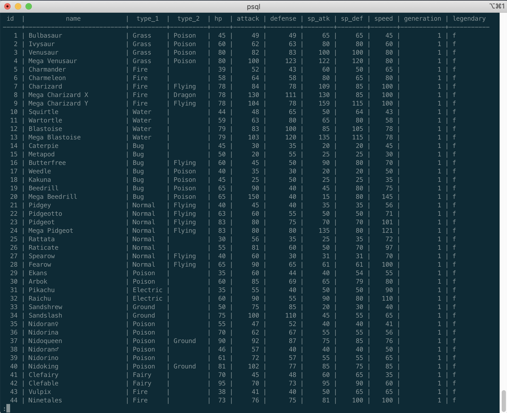
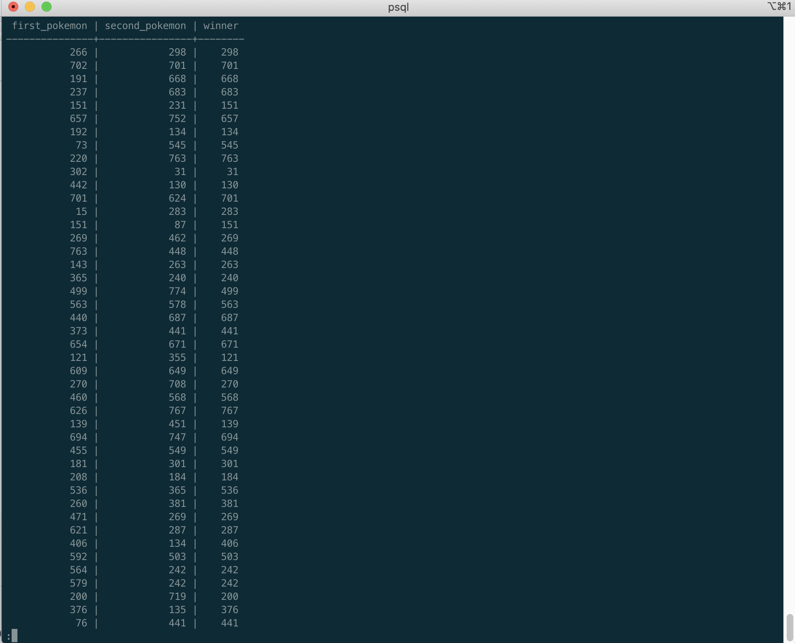
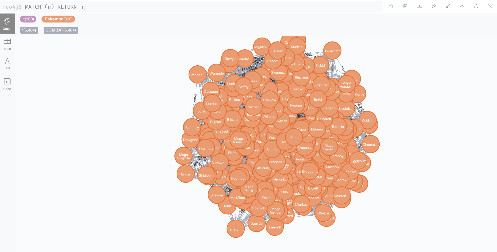
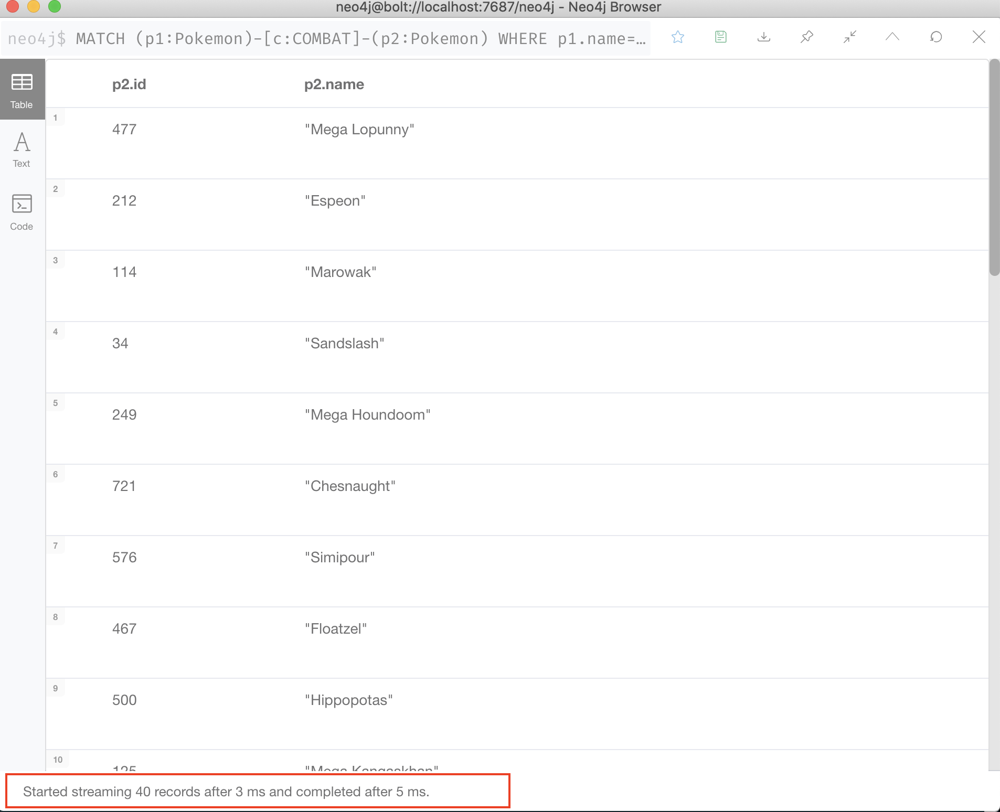
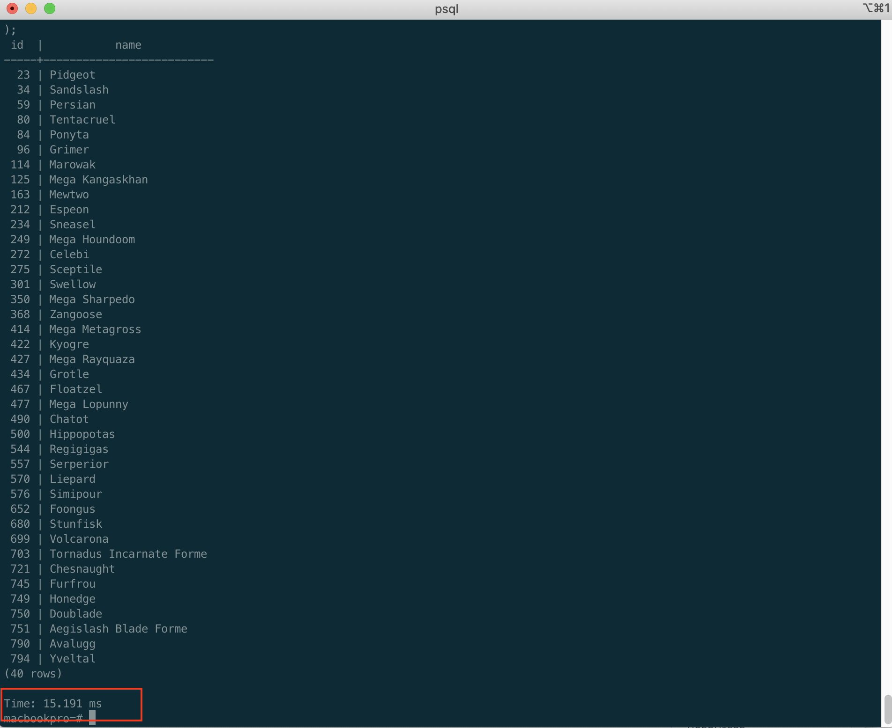
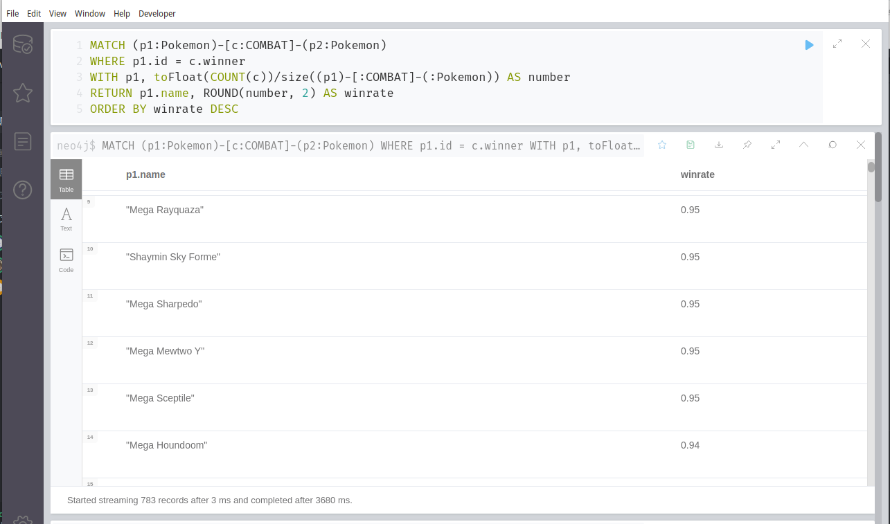
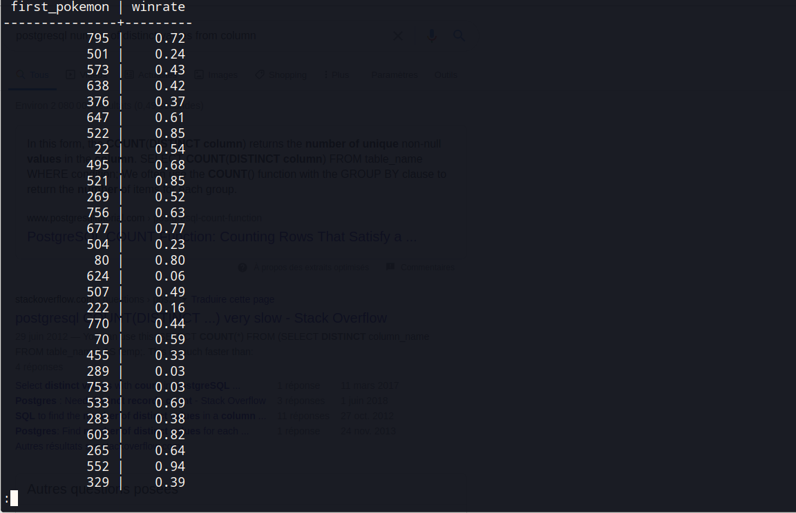
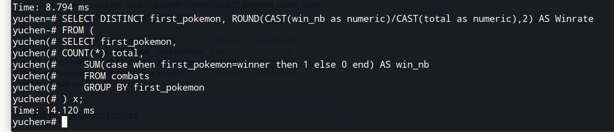

# Implémentation d'une BD graphe dans Neo4j

*WANG Shiying, 21960641, M2 Informatique parcours DATA*  (shiyingw95@gmail.com)

*BAI Yuchen, 71418516,  M2 Informatique parcours DATA (yuchenbai@hotmail.com)*


## Choix et import d'un jeu de données

### 1. Choisir un jeu de données.

- Nous avons choisi **Pokémon** comme notre base de données: https://www.kaggle.com/terminus7/pokemon-challenge?select=pokemon.csv

  

- Il y a 2 tableaux csv. 
  -  L'un est la liste des Pokémon (*pokemon.csv*), qui comprend l'identifiant du Pokémon, son nom, ses types d'attaque, les différentes valeurs d'attributs, les générations et les légendes.
  - L'autre est le tableau des combats des Pokémon (*combats.csv*), qui comprend les résultats de leurs rencontres individuelles.

### 2. Implémenter une base de données relationnelle dans PostgreSQL

- Réussir à importer 2 tableaux csv selon des requêtes de notre fichier Requetes.

  
  
  

### 3. Implémenter une base de données graphe dans Neo4j

- Réussir à importer 2 tableaux csv selon des requêtes de notre fichier Requetes.

  


(记得写：stratégie d'import de données)

(记得写：nos choix de modélisation)

### Requêtes de Neo4j

----------

### 1. Neo4j

### 2. Neo4j vs Postgresql

1. On va trouver tous les pokémons qui a gagné le match avec Pikachu, retourne **id** et **name** de pokémon.

   * Pour Neo4j, la requête est ci-dessous:

     ```cypher
     MATCH (p1:Pokemon)-[c:COMBAT]-(p2:Pokemon) WHERE p1.name='Pikachu' AND c.winner=p2.id RETURN p2.id, p2.name ORDER BY p2.id
     ```

     On parcourt les nodes autours de node **'Pikachu'** type pokemon en **'depth=1'**. C'est en temps O(1) (plus petits que 800 nodes O(M), parce qu'on a 800 en total). Donc c'est rapide.

      

   * Pour PostgreSQL, la requête est ci-dessous:

     ```sql
     SELECT P.id, P.name 
     FROM pokemon P
     WHERE P.name <> 'Pikachu' 
     AND P.id IN (
     	SELECT C.winner
     	FROM combats C JOIN pokemon P
     	ON (P.id = C.first_pokemon OR P.ID = C.second_pokemon)
     	WHERE P.name = 'Pikachu'
     );
     ```

     Il est évident que la commande en verison SQL est plus coûteux. D'abord, on trouve tous les id de pokemons qui a gagné le match avec **'Pikachu'**, il faut parcours **'COMBAT'** pour tous les id et c'est environ 50000,  O(N). Et pour chaque pokemon dand la table **'Pokemon'**, il faut parcourir les id qu'on obtient doussus. Donc la compléxité de cette requête est environ O(M * N).

     

   * Résultat : **Neo4j - 5ms vs PostgreSQL - 15ms**, Neo4j est plus efficace. 

2. On va trouver les **winrates** pour tous les pokémons

   * Pour Cypher :

     ```cypher
     MATCH (p1:Pokemon)-[c:COMBAT]-(p2:Pokemon) 
     WHERE p1.id = c.winner
     WITH p1, toFloat(COUNT(c))/size((p1)-[:COMBAT]-(:Pokemon)) AS number
     RETURN p1.name, ROUND(number, 2) AS winrate
     ORDER BY winrate DESC
     ```

     Pour chaque node du **'Pokemon'**, O(M) parcours, on va parcourir tous les données du **'Combat'**, O(N). Donct on a la compléxité O(M*N).

     

   * Pourtant, pour la requête SQL:

     ```sql
     SELECT DISTINCT first_pokemon, ROUND(CAST(win_nb as numeric)/CAST(total as numeric),2) AS Winrate
     FROM (
     SELECT first_pokemon,
     COUNT(*) total,
         SUM(case when first_pokemon=winner then 1 else 0 end) AS win_nb
         FROM combats
         GROUP BY first_pokemon
     ) x
     ORDER BY Winrate;
     ```

     On parcourt **Combat** une fois, c'est moins coûteux que la requête Cypher.

     

     

   * Résultat : **Neo4j - 3680 ms vs PostgreSQL - 14.12 ms**, Neo4j est plus efficace. 

## Analytique de graphe

### 1. Algorithmes de la Grouph Data Science Library


### 2. Utiliser des projections nommées


### 3. Utiliser bloom pour visualiser l'analyse de nos données


## Bonus

