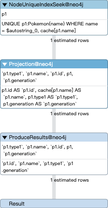
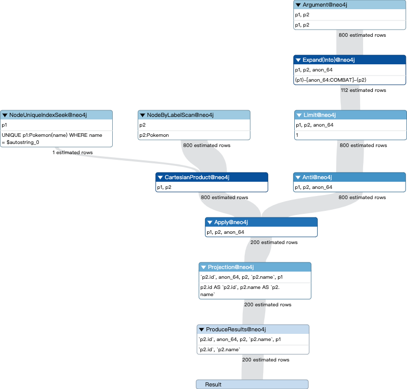

# Implémentation d'une BD graphe dans Neo4j

*WANG Shiying, 21960641, M2 Informatique parcours DATA*  (shiyingw95@gmail.com)

*BAI Yuchen, 71418516,  M2 Informatique parcours DATA (yuchenbai@hotmail.com)*


## 1. Choix et import d'un jeu de données

### 1.1 Choisir un jeu de données.

- Nous avons choisi **Pokémon** comme notre base de données: https://www.kaggle.com/terminus7/pokemon-challenge?select=pokemon.csv

  

- Il y a 2 tableaux csv. 
  -  L'un est la liste des Pokémon (*pokemon.csv*), qui comprend l'identifiant du Pokémon, son nom, ses types d'attaque, les différentes valeurs d'attributs, les générations et les légendes.
  - L'autre est le tableau des combats des Pokémon (*combats.csv*), qui comprend les résultats de leurs rencontres individuelles.

### 1.2 Implémenter une base de données relationnelle dans PostgreSQL

- Réussir à importer 3 tableaux csv selon des requêtes de notre fichier Requetes.

  ```sql
  -------------------------
  -- 01 creer les tables --
  -------------------------
  DROP TABLE IF EXISTS bds.Pokemon CASCADE;
  DROP TABLE IF EXISTS bds.Combats CASCADE;
  DROP TABLE IF EXISTS bds.Pokemon_bis CASCADE;
  DROP SCHEMA IF EXISTS bds CASCADE;
  
  CREATE SCHEMA bds;
  
  CREATE TABLE bds.Pokemon(
      Id INTEGER UNIQUE,
      Name VARCHAR(80) UNIQUE,
      Type_1 VARCHAR(50),
      Type_2 VARCHAR(50),
      HP INTEGER CONSTRAINT hp_positif CHECK(HP>0),
      Attack INTEGER,
      Defense INTEGER,
      Sp_Atk INTEGER,
      Sp_Def INTEGER,
      Speed INTEGER,
      Generation INTEGER,
      Legendary BOOLEAN NOT NULL,
      PRIMARY KEY (Id, Name)
  );
  
  CREATE TABLE bds.Combats(
      First_pokemon INTEGER,
      Second_pokemon INTEGER,
      Winner INTEGER,
      FOREIGN KEY (First_pokemon) REFERENCES bds.Pokemon(Id) ON DELETE CASCADE,
      FOREIGN KEY (Second_pokemon) REFERENCES bds.Pokemon(Id) ON DELETE CASCADE,
      FOREIGN KEY (Winner) REFERENCES bds.Pokemon(Id) ON DELETE CASCADE
  );
  
  CREATE TABLE bds.Pokemon_bis(
      Abilities VARCHAR(100),
      against_bug FLOAT,
      against_dark FLOAT,
      against_dragon FLOAT,
      against_electric FLOAT,
      against_fairy FLOAT,
      against_fight FLOAT,
      against_fire FLOAT,
      against_flying FLOAT,
      against_ghost FLOAT,
      against_grass FLOAT,
      against_ground FLOAT,
      against_ice FLOAT,
      against_normal FLOAT,
      against_poison FLOAT,
      against_psychic FLOAT,
      against_rock FLOAT,
      against_steel FLOAT,
      against_water FLOAT,
      base_egg_steps INTEGER,
      capture_rate INTEGER CONSTRAINT capture_rate_limit CHECK(capture_rate<256),
      height_m FLOAT,
      name VARCHAR(80) UNIQUE,
      percentage_male FLOAT,
      id INTEGER UNIQUE,
      type1 VARCHAR(50),
      type2 VARCHAR(50),
      weight_kg FLOAT,
      generation INTEGER,
      is_lengendary BOOLEAN,
      PRIMARY KEY (id, name)
  );
  
  
  --------------------
  -- 02 Insert Data --
  --------------------
  
  -- selon pwd, on trouve le path de les fichiers
  \set pokemon_path `pwd`'/pokemon.csv'
  \set combats_path `pwd`'/combats.csv'
  \set pokemon_bis_path `pwd`'/pokemon_bis.csv'
  
  COPY bds.Pokemon FROM :'pokemon_path' WITH DELIMITER ',' CSV HEADER;
  COPY bds.Combats FROM :'combats_path' DELIMITER ',' CSV HEADER;
  COPY bds.Pokemon_bis FROM :'pokemon_bis_path' WITH DELIMITER ',' CSV HEADER;
  
  --------------------------
  -- 03 Grant les droites --
  --------------------------
  
  GRANT USAGE ON SCHEMA bds to PUBLIC;
  GRANT SELECT ON ALL TABLES IN SCHEMA bds to PUBLIC;
  GRANT INSERT ON ALL TABLES IN SCHEMA bds to PUBLIC;
  
  ---------------------
  -- 04 create index --
  ---------------------
  
  DROP INDEX IF EXISTS index_pokemon_id;
  DROP INDEX IF EXISTS index_pokemon_name;
  DROP INDEX IF EXISTS index_pokemon_bis_id;
  DROP INDEX IF EXISTS index_pokemon_bis_name;
  DROP INDEX IF EXISTS index_combats_first_id;
  
  CREATE INDEX index_pokemon_id ON Pokemon USING BTREE (Id);
  CREATE INDEX index_pokemon_name ON Pokemon USING HASH (Name);
  CREATE INDEX index_pokemon_bis_id ON Pokemon_bis USING BTREE (id);
  CREATE INDEX index_pokemon_bis_name ON Pokemon_bis USING HASH (name);
  CREATE INDEX index_combats_first_id ON Combats USING BTREE(First_pokemon);
  
  --------------------
  -- 05 search path --
  --------------------
  
  --set search_path
  SHOW search_path;
  -- ici, 'bai' est mon login, vous devez le remplacer par votre
  SET search_path TO bds,PUBLIC
  ```

  

  

### 1.3 Implémenter une base de données graphe dans Neo4j

- Réussir à importer 3 tableaux csv selon des requêtes de notre fichier Requetes.

  ```cypher
  DROP INDEX index_pokemon IF EXISTS
  
  CREATE INDEX index_pokemon IF NOT EXISTS
  FOR (n:Pokemon)
  ON (n.Id, n.Name)
  
  LOAD CSV with headers FROM 'file:///pokemon.csv' AS row
  CREATE (p:Pokemon{
      id: toInteger(row.Id),
      name: row.Name,
      type1: row.Type_1,
      type2: row.Type_2,
      hp: toInteger(row.Hp),
      attack: toInteger(row.Attack),
      defense:toInteger(row.Defense),
      sp_atk: toInteger(row.Sp_Atk),
      sp_def: toInteger(row.Sp_Def),
      speed: toInteger(row.Speed),
      generation: toInteger(row.Generation),
      legendary: toBoolean(row.Lengendary)
  })
  
  CREATE CONSTRAINT ON (n:Pokemon) ASSERT n.name IS UNIQUE
  
  CREATE CONSTRAINT ON (n:Pokemon) ASSERT n.id IS UNIQUE
  
  LOAD CSV with headers FROM 'file:///pokemon_bis.csv' AS row
  CREATE (p2:Pokemon_bis{
      ag_bug: toFloat(row.against_bug),
      ag_dark: toFloat(row.against_dark),
      ag_dragon: toFloat(row.against_dragon),
      ag_electric: toFloat(row.against_electric),
      ag_fairy: toFloat(row.against_fairy),
      ag_fire: toFloat(row.against_fire),
      ag_flying: toFloat(row.against_flying),
      ag_ghost: toFloat(row.against_ghost),
      ag_grass: toFloat(row.against_grass),
      ag_ground: toFloat(row.against_ground),
      ag_ice: toFloat(row.against_ice),
      ag_normal: toFloat(row.against_normal),
      ag_poison: toFloat(row.against_poison),
      ag_psychic: toFloat(row.against_psychic),
      ag_rock: toFloat(row.against_rock),
      ag_steel: toFloat(row.against_steel),
      ag_water: toFloat(row.against_water),
      cp: toInteger(row.capture_rate),
      h: toFloat(row.height_m),
      name: row.name,
      male_percentage: row.percentage_male,
      id: toInteger(row.id),
      type1: row.type1,
      type2: row.type2,
      w: toFloat(row.weight_kg),
      g: toInteger(row.generation)
  })
  
  :auto USING PERIODIC COMMIT 500
  LOAD CSV WITH HEADERS FROM 'file:///combats.csv' AS row
  MATCH (p1:Pokemon {id: toInteger(row.First_pokemon)}), (p2:Pokemon {id: toInteger(row.Second_pokemon)})
  MERGE (p1)-[:COMBAT {winner: toInteger(row.Winner)}]-(p2)
  
  MATCH (p1:Pokemon),(p2:Pokemon_bis)
  WHERE p1.name = p2.name
  MERGE (p1)-[:SAME]-(p2)
  ```

  

  

  


## 2. Requêtes

### 2.1 Neo4j

1. Trouver le pokémon **'Pikachu'**

   ```cypher
   MATCH (p1:Pokemon)
   WHERE p1.name = "Pikachu"
   RETURN p1.id, p1.name, p1.type1, p1.generation
   ```

   * plan d'exécution avec **INDEX**

     

   * Plan d'exécution sans **INDEX**

     

2. Trouver les pokémons qui ne sont pas le rival de **'Pikachu'**.

   ```cypher
   MATCH (p1:Pokemon{name:'Pikachu'}), (p2:Pokemon)
   WHERE NOT (p1)-[:COMBAT]-(p2)
   RETURN p2.id, p2.name
   ```

   * plan d'exécution avec **INDEX**

   

   * Plan d'exécution sans **INDEX**

     

3. Trouver le nombre de pokémon qui ne sont pas le rival de **'Pikachu'**

   ```cypher
   MATCH (p1:Pokemon{name:'Pikachu'}), (p2:Pokemon)
   WHERE NOT (p1)-[:COMBAT]-(p2)
   RETURN p2.id, p2.name
   ```

   * Plan

### 2.2 Neo4j vs Postgresql

1. On va trouver tous les pokémons qui a gagné le match avec Pikachu, retourne **id** et **name** de pokémon.

   * Pour Neo4j, la requête est ci-dessous:

     ```cypher
     MATCH (p1:Pokemon)-[c:COMBAT]-(p2:Pokemon) WHERE p1.name='Pikachu' AND c.winner=p2.id RETURN p2.id, p2.name ORDER BY p2.id
     ```

     On parcourt les nodes autours de node **'Pikachu'** type pokemon en **'depth=1'**. C'est en temps O(1) (plus petits que 800 nodes O(M), parce qu'on a 800 en total). Donc c'est rapide.

     

   * Pour PostgreSQL, la requête est ci-dessous:

     ```sql
     SELECT P.id, P.name 
     FROM pokemon P
     WHERE P.name <> 'Pikachu' 
     AND P.id IN (
     	SELECT C.winner
     	FROM combats C JOIN pokemon P
     	ON (P.id = C.first_pokemon OR P.ID = C.second_pokemon)
     	WHERE P.name = 'Pikachu'
     );
     ```

     Il est évident que la commande en verison SQL est plus coûteux. D'abord, on trouve tous les id de pokemons qui a gagné le match avec **'Pikachu'**, il faut parcours **'COMBAT'** pour tous les id et c'est environ 50000,  O(N). Et pour chaque pokemon dand la table **'Pokemon'**, il faut parcourir les id qu'on obtient doussus. Donc la compléxité de cette requête est environ O(M * N).

     

   * Résultat : **Neo4j - 5ms vs PostgreSQL - 15ms**, Neo4j est plus efficace. 

2. On va trouver les **winrates** pour tous les pokémons

   * Pour Cypher :

     ```cypher
     MATCH (p1:Pokemon)-[c:COMBAT]-(p2:Pokemon) 
     WHERE p1.id = c.winner
     WITH p1, toFloat(COUNT(c))/size((p1)-[:COMBAT]-(:Pokemon)) AS number
     RETURN p1.name, ROUND(number, 2) AS winrate
     ORDER BY winrate DESC
     ```

     Pour chaque node du **'Pokemon'**, O(M) parcours, on va parcourir tous les données du **'Combat'**, O(N). Donct on a la compléxité O(M*N).

     

   * Pourtant, pour la requête SQL:

     ```sql
     SELECT DISTINCT first_pokemon, ROUND(CAST(win_nb as numeric)/CAST(total as numeric),2) AS Winrate
     FROM (
     SELECT first_pokemon,
     COUNT(*) total,
         SUM(case when first_pokemon=winner then 1 else 0 end) AS win_nb
         FROM combats
         GROUP BY first_pokemon
     ) x
     ORDER BY Winrate;
     ```

     On parcourt **Combat** une fois, c'est moins coûteux que la requête Cypher.

     

     

   * Résultat : **Neo4j - 3680 ms vs PostgreSQL - 14.12 ms**, PostgreSQL est plus efficace. 

3. On va trouver les rivaux de **'Pikachu'** et les rivaux de rivaux (depth=2) qui sont dans la table **Combat** :

   * Pour Neo4j:

     ```cypher
     MATCH (p1:Pokemon)-[:COMBAT*1..2]-(p2:Pokemon)
     WHERE p1.name = 'Pikachu'
     RETURN p2
     ```

     

     C'est plus rapide, le principe est comme qu'on parcourt les nodes dans un graphe, pas besoin de parcourir tous les records de table. On peut voir le plan d'exécution.

     

   

   * Pour PostgreSQL:

     ```mysql
     WITH RECURSIVE cte AS (
     	SELECT P.id, P.name, C.second_pokemon, 0 AS depth 
         FROM pokemon P 
         JOIN combats C
     	ON P.id = C.first_pokemon
         WHERE P.name = 'Pikachu'
         UNION ALL
         SELECT P2.id, P2.name, C.second_pokemon,cte.depth+1
         FROM pokemon P2 
         JOIN combats C
     	ON P2.id = C.first_pokemon
         JOIN cte ON P2.id = cte.second_pokemon
         WHERE (cte.depth<3 AND P2.name <> 'Pikachu')
     )
     SELECT DISTINCT C.id, C.name, C.depth
     FROM cte C;
     ```

     Il est plus couteuse qand on utilise SQL. C'est parce qu'il faut parcourir la table **Combat** chaque itération. 

     

     

     Avec **EXPLAIN**, on peut observer la structure du notre commande.

     

   * Résultat : **Neo4j - 14 ms vs PostgreSQL - 23701 ms**, Neo4j est plus efficace. 


## 3. Analytique de graphe

### 3.1 Algorithmes de la Grouph Data Science Library

1. Algo shortest path - graphe anonyme

   ```cypher
   MATCH (p1:Pokemon {name:"Pikachu"}), (p2:Pokemon {name:"Bulbasaur"})
   CALL gds.alpha.shortestPath.stream({
       startNode: p1,
       endNode: p2,
       nodeProjection: "*",
       relationshipProjection:{
       all:{
           type: "*",
           orientation: "UNDIRECTED"
   		}
   	}
   })
   YIELD nodeId
   RETURN gds.util.asNode(nodeId).name AS pp; 
   ```

   

2. Algo pagerank - graphe nommé

   ```cypher
   CALL gds.graph.create.cypher(
       'graphe_pokemon',
       'MATCH (p:Pokemon) RETURN p.id AS id',
       'MATCH (p1)-[:COMBAT]-(p2) RETURN p1.id AS source, p2.id AS target'
   )
   ```

   ```cypher
   CALL gds.pageRank.stream('graphe_pokemon')
   YIELD nodeId, score
   RETURN gds.util.asNode(nodeId).name AS name, score
   ```

   ```cypher
   CALL gds.pageRank.write('graphe_pokemon', {writeProperty:'pageRank'})
   YIELD nodePropertiesWritten, ranIterations
   ```

   

3. Algo degree

   ```cypher
   CALL gds.alpha.degree.stream('graphe_pokemon')
   YIELD nodeId, score
   RETURN gds.util.asNode(nodeId).name AS name, score
   ORDER BY score DESC LIMIT 10
   ```

   

4. Algo louvain

   ```cypher
   CALL gds.louvain.stream('graphe_pokemon')
   YIELD nodeId, communityId
   RETURN gds.util.asNode(nodeId).name AS name, communityId
   ```

   ```cypher
   CALL gds.louvain.stats('graphe_pokemon')
   YIELD communityCount
   ```

   ```cypher
   CALL gds.louvain.mutate('graphe_pokemon', { mutateProperty: 'communityId' })
   YIELD communityCount, modularity, modularities
   ```

   ```cypher
   CALL gds.alpha.degree.write('graphe_pokemon', {writeProperty:'weightedFollowers'})
   YIELD nodes, writeProperty
   ```

   


### 3.2 bloom 

1. Voir les node qui a une relation avec **'Pikachu'**

   

   

2. La relation **'SAME'**

   

3. Shortest path entre **'Pikachu'** et **'Mega Aerodactyl'**

   

   

   

   

   

## 4. Bonus

 